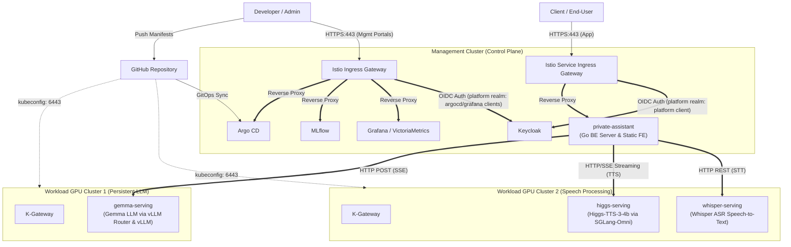
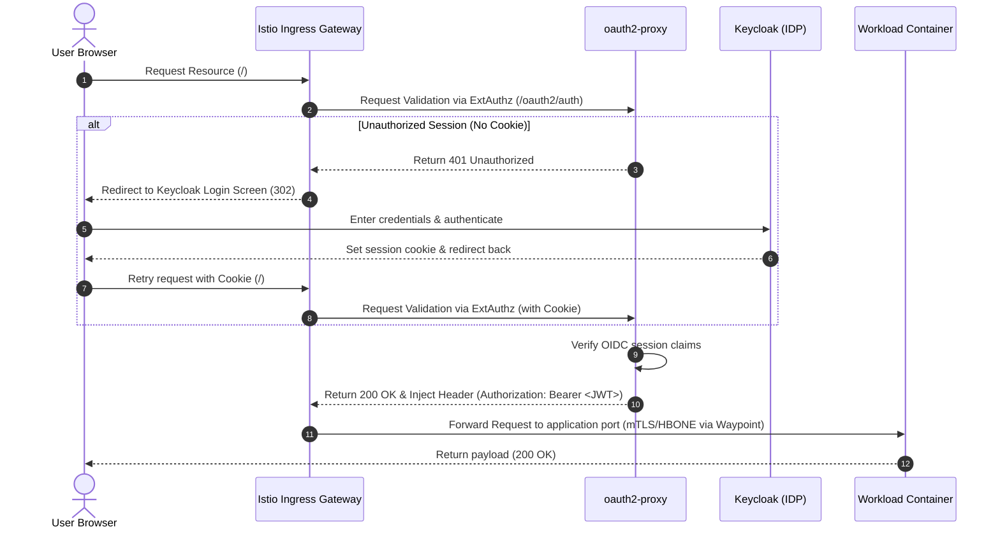
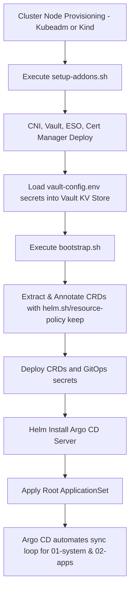

# Multi-Cluster GitOps Platform for Private Assistant: Architecture, Design, and Deployment Guide

This repository defines a multi-cluster GitOps architecture that separates the control plane orchestration from the worker GPU inference nodes while keeping all clusters self-contained and independent.

---

## 1. System Topology & Architecture



### 1.1 Cluster Roles and Autonomy
* **Management Cluster (Control Plane)**: Hosts shared platform-level services such as GitOps orchestration (Argo CD), centralized monitoring/logging storage, identity provider (Keycloak), and model registry (MLflow).
* **Workload GPU Clusters**: Act as worker clusters under the Management cluster orchestration. They run the GPU-accelerated application pods (`gemma-serving`, `higgs-serving`, and `whisper-serving`) and run identical local runtime controllers (`kgateway`, `gpu-operator`, etc.) to operate their workloads locally, excluding Argo CD.

### 1.2 Ingress Traffic and Streaming Routing
* **Developer / Administrator Access (Istio Ingress)**: Administrators access the management plane portals (Argo CD, MLflow, Grafana dashboards, Keycloak Admin UI) through the **Istio Ingress Gateway** (`management-gateway` in the `istio-system` namespace), authenticated via Keycloak using dedicated clients (`argocd`, `grafana`, `argo-workflows`) in the unified `platform` realm.
* **Client / End-User Access (Istio Ingress)**: End-users access the `private-assistant` application through the **Istio Service Ingress Gateway** (`service-gateway` in the `istio-system` namespace). User authentication is handled via Keycloak using the dedicated `platform` client in the same `platform` realm.
* **Streaming Routing**: Real-time WebSocket streaming traffic is terminated at the Backend server, which acts as the orchestrator. Backend interacts with Higgs (TTS), Whisper (STT), and Gemma (LLM) via cluster-internal private routing. External clients never connect directly to workload GPU pods, maintaining container isolation.
* **Virtualization Integrity**: All routing is managed through the Gateway API. Workload pods do not use `hostNetwork` or `hostPort`, preserving container virtualization boundaries.

---

## 2. Core Design Principles

### 2.1 Complete Separation of Control Plane and Workload
Control plane orchestration and cluster state tracking are centralized within the Management cluster, isolating the worker clusters from administrative overhead. Workload clusters focus purely on heavy GPU inference tasks and local networking enforcement.

### 2.2 Isolation of Out-of-Band Addons and GitOps Applications
To prevent bootstrapping race conditions (circular dependencies) and ensure resilience during complete control-plane recovery, the platform splits resources into two installation layers:

| Layer | Components | Control / Lifecycle | Key Technical Rationale |
| :--- | :--- | :--- | :--- |
| **Infrastructure Addons** | Cilium CNI, Cert Manager, Vault, ESO | Provisioned out-of-band | **Bootstrap Prerequisites**: Establishes kernel-level routing (Cilium), secret access (Vault/ESO), and PKI validation (Cert Manager). These must be fully active before the GitOps engine (Argo CD) can pull private repository manifests. |
| **GitOps System Apps** | Keycloak, MLflow, VictoriaMetrics, Postgres, Valkey | Argo CD ApplicationSet | **Reconciliation Loop**: Stateful platform runtimes require active configuration drift detection, rolling upgrades, and Git-tracked rollbacks. |

#### Technical Rationales for Out-of-Band Addon Provisioning:
1. **Circular Bootstrapping Dependencies**: Argo CD requires private repository access keys resolved from Vault via ESO. Vault and ESO must be active beforehand; otherwise, the CD controller cannot authenticate to fetch its own configuration manifests.
2. **Control Plane & CNI Stability**: Cilium operates at the Linux kernel routing level via eBPF. Binding CNI to the GitOps lifecycle exposes the cluster to complete isolation: any synchronization drift or pruning event would disconnect node routing, locking the CD engine out of the API server and preventing automated recovery.
3. **PKI & API Validation Race Conditions**: Ingress controllers (Istio Ingress Gateway, K-Gateway) and platform services (Keycloak) declare custom `Certificate` resources to automate TLS termination. Cert Manager must be pre-installed to register its CRDs (`certificates.cert-manager.io`) in the API server before Argo CD attempts to reconcile these platform manifests.
4. **Blast Radius Mitigation**: Decoupling core routing (Cilium), PKI issuers (Cert Manager), and primary secrets storage (Vault) from the GitOps pipeline ensures cluster-wide primitives remain online during GitOps misconfigurations or CD engine failures.

### 2.3 Dynamic Resource Allocation (DRA v1) for GPUs
* Implements Kubernetes 1.34+ Dynamic Resource Allocation (DRA) alongside the NVIDIA GPU DRA Driver.
* Eliminates the need for static Nvidia Device Plugin mappings, instead binding GPU hardware dynamically via `ResourceClaimTemplates` when pods scale, ensuring container virtualization integrity.

### 2.4 Defense-in-Depth Ingress Authentication
* **Gateway-level External Authentication (`oauth2-proxy`)**: Applied to all non-OIDC applications (e.g. MLflow on the management plane, and `private-assistant` on the service plane). For these apps, the ingress gate intercepts traffic and prompts login. Upon verification, the gateway injects an `Authorization: Bearer <JWT>` header to the upstream connection.
* **Waypoint Security**: Pod-level strict JWT validation has been decoupled and removed from the workload to prevent latency and routing overhead. Secure mTLS and L4 authorization policies on the waypoint gateway ensure that the backend workload is isolated and only accepts requests routed via the authenticated Ingress Gateway path.
* **Native OIDC Integration**: Applications featuring native OIDC capabilities (Argo CD, Grafana, Argo Workflows, HashiCorp Vault) bypass the gateway-level proxy and authenticate users directly. This prevents double-login loops and guarantees session isolation (avoiding administrative session leakage from standard users).

---

## 3. Component Version Matrix

The platform is designed to run on a single or multi-node Kubernetes cluster. The framework components and their corresponding versions are outlined below.

| Layer | Component Name | Base Version / Image Tag | Helm Chart Version | Remarks |
| :--- | :--- | :--- | :--- | :--- |
| **OS / K8s** | Kubernetes | `v1.35.6` | - | Native DRA v1 support |
| **Infra Addons** | Cilium CNI | `1.19.5` | `1.19.5` | eBPF host routing (KubeProxyReplacement) |
| **Infra Addons** | HashiCorp Vault | `2.0.2` | `0.33.0` | Raft HA Mode |
| **Infra Addons** | External Secrets | `v2.7.0` | `2.7.0` | Synchronizes Vault secrets to K8s |
| **Infra Addons** | Cert Manager | `v1.20.3` | `v1.20.3` | Handles PKI and certificate issuance |
| **GitOps System**| Argo CD | `v3.4.4` | `10.1.0` | Central continuous deployment engine |
| **GitOps System**| Keycloak IDP | `26.5.4` | `3.0.6` | OIDC Identity Provider (Image tag overridden in manifest) |
| **GitOps System**| PostgreSQL | `18-alpine` | - | Shared DB for Keycloak, MLflow, and Argo |
| **GitOps System**| Valkey | `9.1.0-alpine` | - | Redis successor for caching |
| **GitOps System**| OpenTelemetry Collector | `0.154.0` | `0.162.0` | Unified metrics & logs collector |
| **GitOps System**| Istio (Ambient) | `1.30.2` | `1.30.2` | L4/L7 sidecarless service mesh |
| **GitOps System**| K-Gateway | `v2.3.5` | `v2.3.5` | Envoy-based user ingress gateway (Deprecated in favor of Istio Service Gateway) |
| **GitOps System**| oauth2-proxy | `7.15.3` | `10.7.0` | Ingress authentication proxy handler |
| **GitOps System**| VictoriaMetrics | `v1.146.0` | `0.85.10` | Grafana (`13.0.*`) and monitoring |
| **GitOps System**| VictoriaLogs | `v1.51.0` | `0.2.7` | VictoriaMetrics logging subsystem |
| **GitOps System**| GPU Operator | `v26.3.3` | `v26.3.3` | NVIDIA GPU driver & runtime provisioning |
| **GitOps System**| NVIDIA DRA Driver | `0.4.1` | `0.4.1` | DRA-based dynamic GPU mapping |
| **GitOps System**| kube-state-metrics | `2.19.1` | `7.5.1` | Kubernetes resource metrics exporter |
| **GitOps System**| Kyverno | `v1.18.1` | `3.8.1` | Kubernetes policy engine |
| **GitOps System**| Argo Workflows | `v4.0.6` | `1.0.18` | Batch workflow engine |
| **GitOps System**| MLflow | `3.13.0` | `1.11.2` | ML model registry (Image tag overridden in manifest) |
| **Inference App** | Gemma Serving   | `google/gemma-4-e4b-it`| - | Running via vLLM Router & vLLM |
| **Inference App** | Higgs Serving   | `bosonai/higgs-tts-3-4b` | - | TTS via SGLang-Omni (`dev`) |
| **Inference App** | Whisper Serving | `fedirz/faster-whisper-server:latest-cpu` | - | STT via faster-whisper-server |

---

## 4. Repository Directory Structure

```text
.
├── README.md                           # This integrated architecture and quick start guide
├── infra/                              # Phase 1: Out-of-band infrastructure setups
│   ├── common/                         # Installer scripts for Cilium, Vault, ESO, Cert Manager, etc.
│   │   ├── generate-secrets.sh         # Helper script to generate credentials
│   │   ├── install-cert-manager.sh     # Cert Manager setup script
│   │   ├── install-cilium.sh           # Cilium CNI setup script
│   │   ├── install-external-secrets.sh # ESO & Vault ClusterSecretStore setup script
│   │   ├── install-local-path.sh       # Local host-path storage provisioner installer
│   │   ├── install-vault.sh            # Vault installation & secret seeder script
│   │   ├── setup-addons.sh             # Addon orchestrator with status self-checks
│   │   └── vault-config.env.template   # Configuration template using Bash Here-Doc for PEM keys
│   ├── kind/                           # Scripts for local test clusters
│   │   ├── create-cluster.sh           # Core Kind cluster creator script
│   │   ├── kind-config.yaml            # Kind cluster multi-node topology configuration
│   │   └── setup-cluster.sh            # Interactive cluster setup orchestrator script
│   ├── kubeadm/                        # Kubeadm setup scripts for VM/Bare-Metal nodes
│   │   ├── config.sh                   # Kubeadm core configuration parameters
│   │   ├── hosts.map                   # Node network map definition
│   │   ├── install-containerd.sh       # Runtime setup script
│   │   ├── install-k8s-tools.sh        # Kubeadm, kubelet, kubectl installation
│   │   ├── install-nvidia.sh           # NVIDIA GPU driver and container toolkit installer
│   │   ├── prepare-node.sh             # Host kernel/OS tuning script
│   │   ├── reset-cluster.sh            # Tear down and clean node configuration script
│   │   ├── setup-cluster.sh            # Interactive cluster setup orchestrator script
│   │   └── setup-hosts.sh              # Multi-node host map installer
│   └── kubespray/                      # Placeholder for future Kubespray integration (Planned)
├── gitops/                             # Phase 2: GitOps continuous delivery source manifests
│   ├── bootstrap/                      # Bootstrapping credentials and CRD loaders
│   │   ├── manifests/                  # ExternalSecret templates (repo and webhook secrets)
│   │   ├── crds/                       # Extracted CRDs with custom safety annotations
│   │   ├── static-crds/                # Ingress/Gateway API experimental schemas
│   │   └── bootstrap.sh                # Main bootstrap script (checks addons, triggers ArgoCD)
│   ├── 00-root-app/                    # Entrypoint ApplicationSet definition
│   │   ├── main-applicationset.yaml    # Spawns main sub-applications locally on Main cluster
│   │   └── sub-applicationset.yaml     # Spawns sub-applications dynamically on Sub clusters
│   ├── 01-system/                      # Shared platform service declarations
│   │   ├── main/                       # Components deployed on Main cluster (Full stack)
│   │   │   ├── keycloak/, mlflow/, postgres/, valkey/, victoria-metrics/, gpu-operator/, kubelet-csr-approver/, etc.
│   │   └── sub/                        # Components deployed on Sub cluster (CPU-only stack)
│   │       ├── postgres/, valkey/, victoria-metrics/, istio/, kgateway/, etc. (No Keycloak/MLflow/GPUs)
│   ├── 02-apps/                        # Real-Time AI Agent applications
│   │   ├── main/                       # Application runtimes on Main Cluster
│   │   │   └── private-assistant/, gemma-serving/, higgs-serving/, whisper-serving/
│   │   └── sub/                        # Mac Kind local bridging and tunnels
│   │       └── cloudflared-tunnel/, gguf-routing/
│   └── shared-charts/                  # Shared base Helm charts & update manager
│       ├── update-chart-versions.sh    # Local vs Remote version comparison and pull manager
│       └── argo-workflows/, gpu-operator/, istio/, keycloak/, kgateway/, victoria-metrics/, etc.
```

---

## 5. SSO & Ingress Authentication Flow

The platform establishes an ingress-to-pod authentication contract, ensuring secure user routing and token validity.

### 5.1 Ingress Authentication Sequence



### 5.2 Ingress and Downstream Security Details
* **Gateway-level External Authentication**: Gateway-level OIDC proxy authentication (`service-gateway-auth` CUSTOM policy) intercepts all user requests and delegates verification to `oauth2-proxy`. If validation succeeds, it injects an `Authorization: Bearer <JWT>` header to the upstream connection.
* **Waypoint Security**: Pod-level strict JWT validation has been decoupled and removed from the workload to prevent latency and routing overhead. Secure mTLS and L4 authorization policies on the waypoint gateway ensure that the backend workload is isolated and only accepts requests routed via the authenticated Ingress Gateway path.

---

## 6. Bootstrap and Installation Flow

The system initializes from host level to workload alignment through three core phases.



### 6.1 Phase 1: Infrastructure Provisioning
1. Compute hosts are initialized using Kubeadm or Kind scripts, configuring system values and running the container runtime.
2. `setup-addons.sh` initiates, installing the CNI (Cilium), Cert Manager, Vault, and ESO in order.
3. Vault configures its internal Kubernetes Authentication endpoint, mapping roles (`eso-role`) and permissions (`eso-policy`).
4. Core secrets (passwords and repository access keys) are seeded into Vault's KV engine from the local configuration file (`vault-config.env`).

### 6.2 Phase 2: GitOps Engine Bootstrapping
1. `bootstrap.sh` triggers, extracting schema templates (CRDs) for local chart implementations (Gateway API, GPU Operator, etc.).
2. The bootstrapper runs a Python script to inject safety annotations (`Prune=false` and `helm.sh/resource-policy: keep`) into CRD manifests, protecting schemas from inadvertent destruction during Argo CD synchronization loops.
3. Git App configuration credentials synchronize via ESO, followed by the deployment of the Argo CD control plane.

### 6.3 Phase 3: Application Lifecycle Reconciliation
1. The root `applicationset.yaml` is registered against the control plane API.
2. The Argo CD controller watches directories inside `gitops/01-system` and `gitops/02-apps`, generating discrete `Application` objects.
3. Using `skipCrds: true` inside helm configurations, applications avoid duplicate CRD registration, binding safely onto the pre-annotated schemas generated in Phase 2.

---

## 7. Setup & Deployment Guide (Instructions)

Follow this logical sequence to set up the multi-cluster GitOps environment:

### 7.1 Step 1: Infrastructure Provisioning (Choose A or B)

#### A) Bare-Metal / VM Cluster Provisioning (Kubeadm)
To provision and configure production-like Bare-metal or VM clusters:
```bash
bash infra/kubeadm/setup-cluster.sh
```
This script guides you through configuring host maps, OS tuning, containerd setup, GPU drivers (if applicable), and initializing Kubernetes with Kubeadm.

#### B) Local Cluster Provisioning (Kind)
For local development and testing using Docker:
```bash
bash infra/kind/setup-cluster.sh
```
This script provisions a local multi-node cluster and verifies node readiness.

---

### 7.2 Step 2: Deploying Infrastructure Addons
Before bootstrapping the GitOps platform, copy the environment configuration file, fill in the secrets, and deploy the essential cluster addons:
1. Copy the configuration template:
   ```bash
   cp infra/common/vault-config.env.template infra/common/vault-config.env
   ```
2. Open `infra/common/vault-config.env` and populate your GitHub App credentials, webhook secret, and raw private key (using the Here-Doc block).
3. Run the addons installer (automatically detects IP addresses and Pod CIDRs, performing self-checks to skip healthy components and reinstall failed ones):
   ```bash
   bash infra/common/setup-addons.sh
   ```

---

### 7.3 Step 3: Bootstrapping the Management Cluster
Before running the bootstrapper, configure and deploy the core GitOps components:
1. Update `repoURL` in both [main-applicationset.yaml](file:///home/jin/git/kubernetes/gitops/gitops/00-root-app/main-applicationset.yaml) and [sub-applicationset.yaml](file:///home/jin/git/kubernetes/gitops/gitops/00-root-app/sub-applicationset.yaml) to point to your GitHub repository.
2. Commit and push your changes to your Git repository.
3. Run the bootstrap script (automatically configures safety annotations for CRDs, installs Argo CD, fetches GitHub App credentials from Vault, and **automatically deploys the Root ApplicationSet** to initialize the sync loops):
   ```bash
   bash gitops/bootstrap/bootstrap.sh
   ```

---

### 7.4 Step 4: Workload Cluster Registration (Optional for Multi-Cluster)
Once Argo CD is running in the management cluster, log in and register your external workload GPU cluster:
```bash
# 1. Login to Argo CD server (via port-forward or ingress)
argocd login <argocd-server-ip>

# 2. Register the remote cluster context to Argo CD
argocd cluster add <workload-context-name> \
  --name workload-cluster-linux \
  --system-namespace argocd
```
