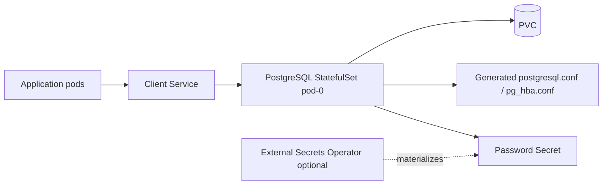
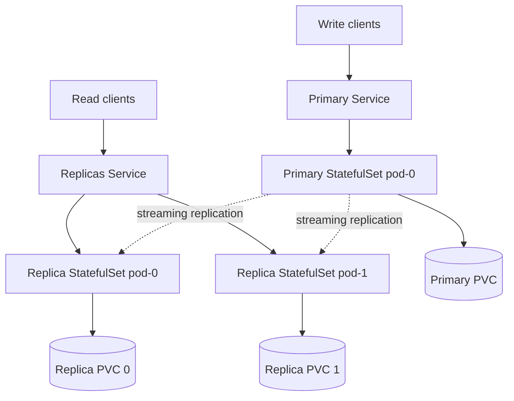
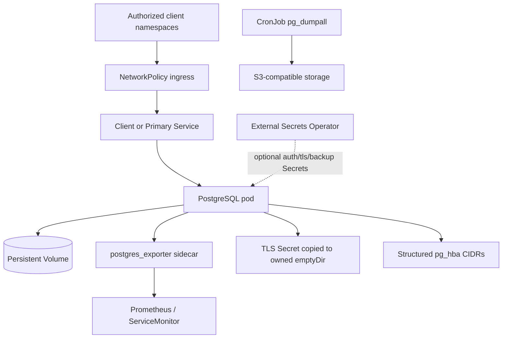

# PostgreSQL Chart Design

## Scope

This chart provides a Helm-native PostgreSQL deployment for development, simple production, and fixed-primary replication use cases.

Supported architectures:

- `standalone`: one writable PostgreSQL pod backed by one PVC
- `replication`: one fixed writable primary plus asynchronous read replicas

The chart intentionally keeps defaults lightweight with the `small` resource
presets. Production users should apply explicit values for credentials,
persistence, workload sizing, network boundaries, backup, metrics, and
scheduling.

## Architecture: Standalone

Standalone mode is appropriate for development, test, internal tooling, and production workloads where restore-based recovery is acceptable.

## Architecture: Fixed-Primary Replication

Replication mode is read scaling and recovery assistance, not automatic HA. The primary is fixed. Promotion, fencing, failover, and reconciliation remain operational workflows outside this chart.

## Architecture: Production Hardening

Production hardening uses opt-in controls:

- `auth.existingSecret`
- `externalSecrets.auth.enabled`
- `config.allowedClientCIDRs`
- `config.allowedReplicationCIDRs`
- `tls.volumePermissions.enabled`
- `replication.slots.enabled`
- `replication.wal.maxSlotWalKeepSize`
- `networkPolicy.egress.enabled`
- `serviceAccount.automountServiceAccountToken=false`

## Main Design Choices

- Use the official `postgres` image as the database runtime.
- Use StatefulSets and PVCs for stable pod identity and storage.
- Render `postgresql.conf` and `pg_hba.conf` from structured values first, with raw escape hatches for advanced cases.
- Bootstrap replicas with `pg_basebackup -R`.
- Keep replication slots optional because they improve WAL safety for lagging replicas but can retain disk indefinitely without limits and monitoring.
- Keep PgBouncer/Pgpool out of scope. Pooling belongs in a separate chart or application/platform layer.
- Render External Secrets Operator resources only when requested. The chart does not install the operator or own provider-side secret stores.
- Keep HA automation out of scope. Use a PostgreSQL operator for automated failover and lifecycle reconciliation.

## Explicit Non-Goals

- automatic failover
- primary election
- fencing
- Patroni, repmgr, or operator-like orchestration
- bundled PgBouncer or Pgpool
- major version migration automation
- PITR controller logic
- backup controller logic inside the chart

## Production Boundary

This chart can be used in production when the operator accepts fixed-primary semantics and provides runbooks for backup, restore, scaling, failover decisions, and incident response.

Use an operator when requirements include:

- automated failover
- switchover workflows
- continuous physical backup and PITR reconciliation
- declarative replica lifecycle management
- synchronous replication policies with failover awareness
