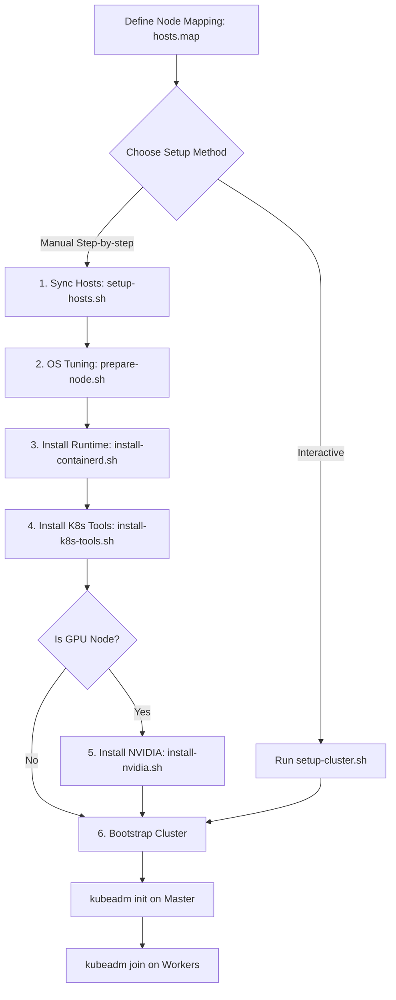

# Kubeadm Cluster Provisioning Guide

This directory contains utility scripts and an interactive orchestrator to provision and configure Kubernetes nodes using `kubeadm` on Bare-metal or Virtual Machine (VM) environments.

---

## 1. Overall Workflow & Architecture

The provisioning process can be executed interactively via the orchestrator script or manually in sequence: host preparation, runtime initialization, tooling setup, and cluster bootstrapping.

The scripts are executed on all nodes (Master & Worker nodes), with NVIDIA installation applied specifically to GPU-enabled worker nodes.



---

## 2. Prerequisites

Before running any setup, you must define the cluster host IP mapping.
1. Copy the example mapping file:
   ```bash
   cp hosts.map.example hosts.map
   ```
2. Edit `hosts.map` to define your master and worker node hostnames and IPs:
   ```text
   192.168.1.10 master-node
   192.168.1.11 worker-node-1
   192.168.1.12 worker-node-gpu
   ```

---

## 3. Interactive Provisioning (Recommended)

An interactive orchestrator script is provided to automate the execution permissions and execution flow step-by-step.

```bash
# Grant execution permissions to setup-cluster.sh and scripts
chmod +x setup-cluster.sh
chmod +x *.sh

# Execute the orchestrator
./setup-cluster.sh
```

Follow the menu prompts on your terminal:
- Select **Master Node Setup Menu** on the control plane server.
- Select **Worker Node Setup Menu** on the backend GPU worker nodes.

---

## 4. Step-by-Step Manual Installation

> [!IMPORTANT]  
> All provisioning scripts require execution permissions (`chmod +x`) and root privileges (`sudo`) to configure system kernels, network configuration, and package installations.

### Step 1: Synchronize Host Names
Configure `/etc/hosts` on all cluster machines to ensure they can resolve each other using their hostnames.
```bash
# Grant execution permissions
chmod +x setup-hosts.sh

# Run with sudo to update /etc/hosts
sudo ./setup-hosts.sh
```

### Step 2: System and Kernel Optimizations
Prepare the host operating system. This script disables Swap memory (mandatory for kubelet), loads kernel modules (`br_netfilter`, `overlay`), and configures system parameters (`sysctl`) for container networking.
```bash
chmod +x prepare-node.sh
sudo ./prepare-node.sh
```

### Step 3: Container Runtime Setup
Install `containerd` container runtime and configure the system boundaries (limits and systemd cgroup driver).
```bash
chmod +x install-containerd.sh

# Basic setup using default directories
sudo ./install-containerd.sh

# Optional: Custom data/state directories can be supplied as arguments
# sudo ./install-containerd.sh <docker-data-root> <docker-exec-root> <containerd-root> <containerd-state>
```

### Step 4: Install Kubernetes Utilities
Install the required Kubernetes node binaries: `kubeadm` (cluster bootstrap tool), `kubelet` (node agent), and `kubectl` (command-line utility).
```bash
chmod +x install-k8s-tools.sh
sudo ./install-k8s-tools.sh
```

### Step 5: (GPU Nodes Only) Setup NVIDIA Drivers & Toolkit
Install NVIDIA display drivers, NVIDIA Container Toolkit, and configure `containerd` to support CUDA container acceleration.
```bash
chmod +x install-nvidia.sh
sudo ./install-nvidia.sh
```

### Step 6: Push Core Images to Private Registry (Optional)
If running in an air-gapped or private registry environment, run this helper to pre-pull and push control plane images to your private container registry.
```bash
chmod +x push-k8s-images.sh
sudo ./push-k8s-images.sh
```

---

## 4. Bootstrapping the Cluster

Once all node setups are completed:
1. **On the Master Node**, initialize the control plane:
   ```bash
   sudo kubeadm init --pod-network-cidr=10.244.0.0/16
   ```
2. **On the Worker Nodes**, run the join command printed by the master initialization output:
   ```bash
   sudo kubeadm join <master-ip>:6443 --token <token> --discovery-token-ca-cert-hash sha256:<hash>
   ```
